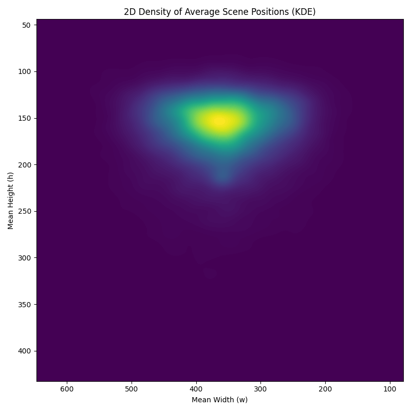

<!-- This is an html comment and this won't appear in the rendered page. You are now editing the "content" area, the core of your description. Everything that you can do in markdown is allowed below. We added a couple of comments to guide your through documenting your progress. -->

## Project definition

### Background

This project is based on the friends annotations dataset, which contains half-episodes that are annotated. The goal of these annotations are to give context about the visual stimuli (FRIENDS half-episodes) that were shown to participants in a fmri machine. This dataset is also one of the dataset available for the Algonauts challenge, where participants use the stimuli data and the brain response data to create brain encoding models.

Here are some questions that encoding models attempt to address that I took from the MAIN educational website :

"Does the variation in the response depend on the stimulus?

How well do the responses ‘encode’ the stimuli?

How well are the responses ‘explained’ by the stimuli?

Can some responses be explained by specific stimuli?

How can we quantify the dependence of responses on the stimuli?" (The MAIN Educational Team, 2024)

Having good robust annotations and analyses on the stimuli acts as a good base to anser these types of questions.

### Tools

- Jupyter notebooks
- Python
- Mystmd
- git and github

### Data

Theses analyses are made on the friends annotations dataset, it is available as a submodule in this [repo](https://github.com/courtois-neuromod/friends_annotations.git)

This dataset contains annotations made for season one to six of FRIENDS and it contains for every half-episode:

Number of scene cuts (PYScene): Ai model that detects scene cuts.

Number of local maxima and location of maximum in pixel space (saliency with deepgazemr): model trained to predict the likelihood of the viewer's gaze position for each movie frame.

Segments annotations (manual annotations): Segments where annotated by a person. It gives detail about onset and offset of each segments depending on their modalities (location change, character entry etc.)

Transcript (Speech2text): AssemblyAI speech-to-text transcription. Produces time-stamped movie transcripts.

### Deliverables

At the end of this project, I will have:
 - Notebooks containing my preprocessing and analyses
 - A pip installable package
 - A myst website
### Main analyses

Plot different relations between scenes, segments, duration, frames, number of local maximas and more!

Types of plots: barplots for frequencies, barplots for proportions, hexbins and kde for density visualisations

Describing the dataset in terms of length of scenes and segments and average number of maxima within scenes in episodes can guide further analysis on the transcripts and emotions by analysing the relation between these modalities.

example of a plot:

## Results
Check out my [website](https://cleode5a7.github.io/friends_compendium/) for the results of my analyses
Package: available on my project's github
Notebooks: Go to website or my website's github for the clean notebooks. For additional plots and extras, go see my notebooks on my project's github.

### Progress overview

I explored 3 of the 5 annotations dataset and made a website with them. The website can still be expanded since there is still tons of possible directions to explore wuth this rich dataset.
Notes:
- Some of the notebooks in my "analyses friends annotations" github contain more content then presented on the website.Some notebooks were also left out for now. They were left out because of narrative reasons and fit in the article (website).
- As of 2025/06/18 there is some missing half-episode, notably episode that were cut in 4 parts. 
### Tools I learned during this project

 * **Tools listed above** I learned a lot during this past month and it thought me debugging. Myst gave me a hard time in the beginning but I figured it out eventually,

##### Other projects
Here are other good examples of repositories:
- [Learning to manipulate biosignals with python](https://github.com/mtl-brainhack-school-2019/franclespinas-biosignals) by François Lespinasse
- [Run multivariate anaylysis to relate behavioral and electropyhysiological data](https://github.com/mtl-brainhack-school-2019/PLS_PV_Behaviour)
- [PET pipeline automation and structural MRI exploration](https://github.com/mtl-brainhack-school-2019/rwickens-sMRI-PET) by Rebekah Wickens
- [Working with PSG [EEG] data from Parkinson's patients](https://github.com/mtl-brainhack-school-2019/Soraya-sleep-data-in-PD-patients) by Cryomatrix
- [Exploring Brain Functional Activation in Adolescents Who Attempted Suicide](https://github.com/mtl-brainhack-school-2019/Anthony-Gifuni-repo) by Anthony Gifuni

## Conclusion and acknowledgement

Thank you Marie, Lune and the TAs of brainhack school for helping me and for guiding me. Also thank you Sara for helping me with myst, we finished brainhack school girl!!!
